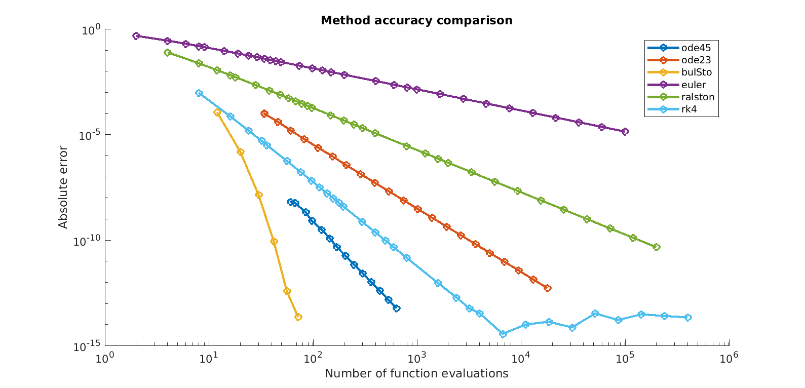

# Lecture 04:

In this lecture we will dive into some of the math for explicit Runge--Kutta methods.
We will start by deriving the stability conditions for Euler's method,
then moving on to a review of second-order methods and their derivation.
Finally, we will conclude with a discussion of the Runge--Kutta Butcher tableau
and The forth-order Runge--Kutta method.

## HW 1 - Graded
- Grades were posted last night
- Most students did well
- Median time to complete assignment: 2.5 hours
- Please read the comments that are posted with your grades
  - I read every line of code and made comments for each student
- Grading will be harder on programming style on future assignments

## HW 1 - Programming Lessons
- Use functions
  - Avoid duplicating large blocks of code
- Use variables
  - Avoid hard-coding array lengths throughout a program
- Use `linspace` and other functions
  - Do not do the math by hand and then hard-code a set of related parameters
    - Good: `a = linspace(0.0, 2.0, 5);`
    - Bad: `a = [0.0, 0.5, 1.0, 1.5, 2.0];`
- Use vectorized code whenever possible

## HW 2 - Updates
- How to you compute acceleration for the pendulum plots?
- [dq; dw] = dynamics([q; w]);  % dw = ddq = acceleration
- call dynamics() on the entire simulation
- Submission details
- you can now upload individual files: I'm slowly learning to use Trunk

## HW 3 - Posted
- Implement three simulation methods and compare them
- Free-form programming assignment

## Numerical Stability of Euler's Method:  overview
- a solution is stable if a perturbation in the initial condition causes a bounded change in the solution at some time in the future.
- how to derive stability conditions?
  - write the expression for two simulations that start with a small different in initial condition
  - write an expression for the difference between the two simulations
  - determine the necessary step size such that the difference is bounded

## Numerical Stability of Euler's Method:  derivation
  - Given:
    - `dx = f(t,x)`
    - `x(k+1) = x(k) + h*f(t(k), x(k))`
    - `xHat(k+1) = xHat(k) + h*f(t(k), xHat(k))`
    - `e(k) = xHat(k) - x(k)`
    - `F(t, x) = (d/dx)f(t,x)`
  - Algebra:  (expression for `e(k+1)`)
    - `e(k+1) = xHat(k+1) - x(k+1)`
    - `e(k+1) = (xHat(k) + h*f(t(k), xHat(k))) - (x(k) + h*f(t(k), x(k)))`
    - `e(k+1) = e(k) + h*f(t(k), xHat(k)) - h*f(t(k), x(k))`
  - Taylor Expansion:  linear approximation of `f(t,x)` (drop `(k)` arguments)
    - `f(t, xHat) = f(t, x) + (d/dx)f(t, x) * (xHat - x)`
    - `f(t, xHat) = f(t, x) + F * e`
  - Substitute `f()` using Taylor expansion
    - `e(k+1) = e(k) + h*f(t(k), x(k)) + h*F(t(k),x(k)) * e(k) - h*f(t(k), x(k))`
      - `e(k+1) = e(k) +  h*F(t(k),x(k)) * e(k)`
      - `e(k+1) = (1 + h*F(t(k),x(k))) * e(k)`
  - Solve for `e(k)` in terms of `e(0)`:
    - `e(k) = e(0) * (1 + h*F(t(k),x(k))) ^ k`
  - Solve for `h*F` such that `e(k)` is bounded as `k --> inf`
    - `abs(1 + h*F(t(k),x(k))) <= 1`
    - `-2 <= 1 + h*F(t(k),x(k)) <= 0`
    - `-1 <= h*F <= 1`
  - See posted derivation (hand-written)

## Brief introduction to numerical quadrature
- Solve: definite integral
  - Simple: Riemann Sum
  - Better: Trapezoid rule
  - Even Better: Simpson's rule
  - Crazy Good: Gauss quadrature
- Brief outline:
  - select a set of "quadrature points"
  - compute the weights at each quadrature point
- Quadrature is hard for differential equations:
  - function value is not known at quadrature points

## Derivation of explicit Runge--Kutta methods
- Part One:
  - Write out the state at the next step using a definite integral
  - Reduce the integral to quadrature
    - number of grid points equal to the order of the method to be constructed
  - Carefully select quadrature points:
    - for second-order explicit method use initial point and then and arbitrary point parameterized by alpha
  - Leave quadrature weights to be computed later
  - State at the lower quadrature point is known
  - State at the upper quadrature point is estimated via Euler's method
    - This step gets tricky for higher-order methods
- Part Two:
  - Taylor series about initial point
    - keep number of terms equal to method order
    - use the chain rule  (derivatives in time and state)
- Part Three:
  - Set the result of part one equal to the result of part two
  - Do a whole bunch of algebra
  - Solve by factoring out powers of h to get quadrature weights in terms of alpha
- See posted derivation (hand-written)

## Second-order Explicit Runge--Kutta Scheme
- Family of methods, parameterized by `alpha`
  - `alpha = 0.5  -->  ` the midpoint method  
  - `alpha = 2/3  -->  ` Ralston's method (best error properties)  
  - `alpha = 1.0  -->  ` Heun's method
- Equations:
  - `k1 = f(t(k), x(k))`  --- function value at `x(k)`
  - `k2 = f(t(k) + alpha*h, x(k) + alpha*h*k1)`  --- function estimate at intermediate point
  - `b1 = 1 - b2`  ---  quadrature weight on the `k1`
  - `b2 = 1/(2*alpha)`  ---  quadrature weight on `k2`
  - `x(k+1) = x(k) + h * (b1*k1 + b2*k2)`

## "The" Forth-order Runge--Kutta Method
- Equations:
  - `k1 = f(t(k), x(k))`
  - `k2 = f(t(k) + 0.5*h, x(k) + 0.5*h*k1)`
  - `k3 = f(t(k) + 0.5*h, x(k) + 0.5*h*k2)`
  - `k4 = f(t(k) + h, x(k) + h*k3)`
  - `x(k+1) = x(k) + (h/6)*(k1 + 2*k2 + 2*k3 + k4)`
- Motivation:
  - Moderate order method: accurate enough for most applications
  - Relatively easy to implement compared to other medium-high order methods
  - Explicit (no solve required)
  - Few floating point operations compared to other 4th-order methods

## Butcher Tableau
- Standardized way to write method parameters for Runge--Kutta methods
- Explicit methods:   (`A` matrix is lower triangular)
```
c1  |
c2  |  a21
c3  |  a31  a32
c4  |  a41  a42  a43
=========================
      b1   b2   b3   b4           <--- quadrature weights
```
- Implicit methods:   
```
c1  |  a11  a12  a13  a14
c2  |  a21  a22  a23  a24
c3  |  a31  a32  a33  a34
c4  |  a41  a42  a43  a44
=========================
      b1   b2   b3   b4           <--- quadrature weights
```
- Forward Euler (Explicit)
```
0  |
========
      1
```
- Backward Euler (Implicit)
```
1  | 1
========
      1
```
- Second-order Runge--Kutta (Explicit)
```
0  |
a  |  a
==================
      (1-b2)  b2           <--- b2 = 1/(2a)
```
- The 4th-order Runge--Kutta (Explicit)
```
0   |
1/2 |  1/2
1/2 |  0      1/2
1   |  0      0      1
=========================
         1/6     1/3    1/3    1/6     
```

## Demo: error vs step count by method



**Figure:** A comparison of error vs step size plots for several common Runge--Kutta methods. Note that both axis are on a log scale.
I included one non-Runge-Kutta method on this list: Burlisch-Stoer (bulSto),
which uses Richardson extrapolation on a sequence of approximations using the
modified midpoint method. The source code (and links) are in the code library,
and I'm happy to explain it in office hours if you're curious. Note that the
order of the method is related to the slope of the line on the plot.
